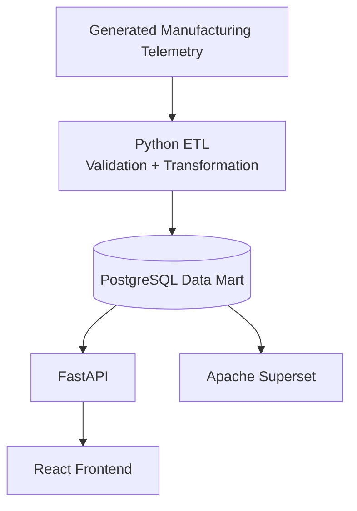

# FactoryPulse

A manufacturing data integration and operations intelligence platform that ingests machine telemetry, processes it through Python ETL pipelines, stores analytical data in PostgreSQL, and delivers operational insights through SQL analytics, Apache Superset dashboards, and a React operations interface.

---

## Overview

In discrete manufacturing environments, machines like CNCs and robotic arms generate continuous physical telemetry—including vibration, bearing temperatures, motor currents, cycle durations, and part yields. FactoryPulse connects this raw edge data to business decision-making by providing an automated pipeline from ingestion to analytics.

The platform uses a modular Python ETL pipeline with built-in data quality validation to transform raw events into hourly Overall Equipment Effectiveness (OEE) metrics stored in a PostgreSQL analytical data mart. Analytical SQL models and an operational alert engine monitor equipment reliability, while Apache Superset and a React 18 frontend make metrics accessible to engineers and plant managers.

---

## Architecture



---

## Key Features

- **Python ETL Pipeline**: Modular extract, validate, transform, and load architecture with execution audit logging.
- **Data-Quality Validation**: Automated validation gates that filter invalid cycle times, missing dimensions, and sensor anomalies.
- **PostgreSQL Data Mart**: Stores structured manufacturing data and hourly OEE summaries for analytical queries.
- **OEE & Downtime Analytics**: Computes Availability, Performance, Quality, MTBF, MTTR, and downtime Pareto distributions.
- **Advanced SQL Analytics**: Analytical queries using CTEs, window functions (`LAG`, `LEAD`, `DENSE_RANK`), and aggregation techniques.
- **FastAPI Backend**: REST API with connection pooling and asynchronous WebSocket telemetry streaming.
- **React Frontend**: Shopfloor monitoring dashboard built with TypeScript, TailwindCSS, and interactive Recharts visualizations.
- **Apache Superset Dashboards**: Containerized BI analytics connected directly to PostgreSQL for executive reporting.
- **Dockerized Services**: Multi-container setup orchestrating PostgreSQL, backend, frontend, and Superset.

---

## Tech Stack

- **Data / ETL**: Python 3.11, Pandas, SQLAlchemy
- **Database**: PostgreSQL 15, analytical data modeling, indexed queries
- **Analytics & BI**: Modern SQL, Apache Superset 3.1.0
- **Backend**: FastAPI, Uvicorn, WebSockets, Pydantic
- **Frontend**: React 18, TypeScript, Vite, TailwindCSS, Recharts
- **DevOps**: Docker, Docker Compose

---

## Project Structure

- **`etl/`**: Modular Python ETL pipeline (`extract.py`, `validate.py`, `transform.py`, `load.py`, `pipeline.py`).
- **`database/`**: Dimensional schema definitions (`schema_dimensional.sql`, `create_datamart.sql`, `create_logs_table.sql`).
- **`sql/`**: Analytical SQL portfolio (`kpi_analysis.sql`, `cte_analysis.sql`, `window_functions.sql`, `downtime_analysis.sql`, `query_optimization.sql`).
- **`backend/`**: FastAPI service, database connection pool, Pydantic schemas, and operational alerts engine (`alerts.py`).
- **`frontend/`**: React 18 TypeScript shopfloor monitoring interface and real-time dashboard.
- **`superset/`**: Apache Superset container configuration and automated PostgreSQL datasource bootstrap script.
- **`tests/`**: Automated test suite for data validation, OEE transformations, and operational alert execution.

---

## Getting Started

### 1. Clone the repository
```bash
git clone https://github.com/satyamkumar8/factorypulse-data-integration.git
cd factorypulse-data-integration
```

### 2. Install Python dependencies
```bash
python -m pip install -r requirements.txt
```

### 3. Start services with Docker Compose
```bash
docker compose up -d
```

### 4. Generate sample telemetry
```bash
python generate_bulk_data.py --rows 5000
```
*(Note: Telemetry data generated by the simulator is synthetic demo data based on discrete manufacturing profiles.)*

### 5. Run the ETL pipeline
```bash
python -m etl.pipeline
```

### 6. Access the applications
- **React Operations Dashboard**: http://localhost:3000
- **FastAPI Documentation**: http://localhost:8000/docs
- **Apache Superset**: http://localhost:8088

---

## Data Flow

```text
Generate Telemetry (Synthetic Sensors)
    ↓
Validate (Data Quality Gate)
    ↓
Transform (Hourly OEE Calculation)
    ↓
Load into PostgreSQL (Idempotent Upsert)
    ↓
Analyze with SQL (CTEs, Window Functions, Pareto)
    ↓
Visualize (Apache Superset & React Dashboard)
```

---

## Example Output

In a standard local verification run on demo data:
- **5,000 raw telemetry records** were ingested into `machine_telemetry`.
- **5,000 records passed validation** through the data quality gate with 0 dropped rows.
- **24 hourly OEE summary records** were generated and loaded into `hourly_production_summary`.
- Verified machine OEE performance averages:
  - `CNC_A`: ~77.5%
  - `CNC_B`: ~80.8%
  - `ROBOT_ARM`: ~68.9%

*(These numbers represent local test run results and are not production benchmarks.)*

---

## Future Improvements

- **Broader Test Coverage**: Expand automated integration tests for asynchronous edge-case streaming scenarios.
- **Incremental Streaming ETL**: Implement real-time windowed micro-batching for continuous ingestion streams.
- **Operational Monitoring**: Add structured metrics collection and automated pipeline failure alerting.
- **Deployment Hardening**: Introduce production-grade environment secret management and CI/CD pipelines.

---

## Author

**Satyam Kumar**  
B.Tech in Computer Science & Engineering